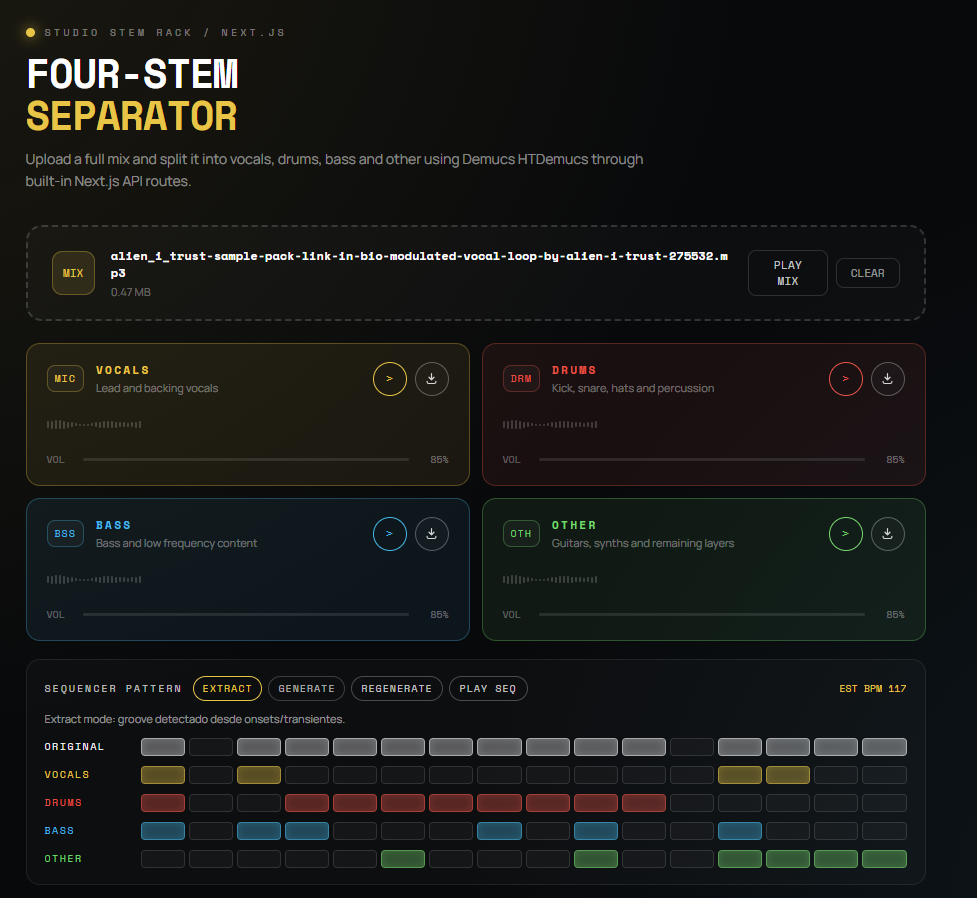

<div align="center">

# 🎚️ STEMS — Four-Stem Separator

**Split any audio track into Vocals · Drums · Bass · Other**
*Powered by [Demucs HTDemucs](https://github.com/facebookresearch/demucs) · Built with Next.js 15 · GPU-accelerated (CUDA)*



</div>

---

## ✨ Features

- 🎤 **Vocals** — lead and backing vocals isolated
- 🥁 **Drums** — kick, snare, hats and all percussion
- 🎸 **Bass** — bass guitar and low-frequency content
- 🎹 **Other** — guitars, synths and remaining layers
- ⚡ **GPU-accelerated** — uses CUDA automatically when a NVIDIA GPU is detected
- 🎛️ **3 quality modes** — Fast (`mdx_extra`), Balanced & Quality (`htdemucs`)
- 🧪 **Browser engine** — HTDemucs ONNX runs client-side and is ready for Vercel-friendly hosting
- 🎵 **Sequencer pattern view** — visual beat grid extracted from each stem, with BPM detection
- 📡 **REST API with CORS** — integrate from any frontend project
- 🔊 **Per-stem volume control** — independent sliders per stem
- ⬇️ **MP3 download** — one click per stem

---

## 🚀 Quick Start

### Prerequisites

| Tool | Version | Notes |
|---|---|---|
| Node.js | ≥ 18 | `node --version` |
| Python | **3.12** | 3.14 is NOT supported by PyTorch |
| FFmpeg | ≥ 6 | must be in `PATH` |
| NVIDIA CUDA driver | 12.1+ | optional, for GPU acceleration |

### Install

```bash
# Node packages
npm install

# Python virtual environment + demucs
py -3.12 -m venv .venv
.venv\Scripts\python.exe -m pip install demucs

# (Optional) CUDA-accelerated PyTorch for NVIDIA GPUs
.venv\Scripts\python.exe -m pip install --force-reinstall torch torchaudio ^
  --index-url https://download.pytorch.org/whl/cu121
```

### Run

```bash
npm run dev
```

Open [http://localhost:3000](http://localhost:3000) 🎉

---

## 📡 REST API

Stems exposes two API routes you can call from **any other project** (CORS enabled).

### `POST /api/separate`

Accepts a `multipart/form-data` request and returns URLs for each stem.

```js
const form = new FormData();
form.append("file", audioFile);     // .wav | .mp3 | .flac | .aiff
form.append("mode", "balanced");    // "fast" | "balanced" | "quality"

const res = await fetch("http://localhost:3000/api/separate", {
  method: "POST",
  body: form,
});

const { runId, stems, mode } = await res.json();
// stems = {
//   vocals: "/api/stems/<runId>/vocals",
//   drums:  "/api/stems/<runId>/drums",
//   bass:   "/api/stems/<runId>/bass",
//   other:  "/api/stems/<runId>/other",
// }
```

### `GET /api/stems/:runId/:stem`

Streams the requested stem as `audio/mpeg`.

```js
const audio = new Audio(`http://localhost:3000${stems.vocals}`);
audio.play();
```

### Restrict allowed origins (optional)

Create `.env.local`:

```env
CORS_ALLOWED_ORIGINS=http://localhost:3001,https://your-other-app.com
```

Without this variable all origins (`*`) are allowed.

---

## 🧠 Processing Modes

| Mode | Model | MP3 Bitrate | Speed | Quality |
|---|---|---|---|---|
| `fast` | `mdx_extra` | 192 kbps | ⚡⚡⚡ | ★★★☆☆ |
| `balanced` | `htdemucs` | 224 kbps | ⚡⚡ | ★★★★☆ |
| `quality` | `htdemucs` | 320 kbps | ⚡ | ★★★★★ |

> GPU (CUDA): ~30-60 s/track · CPU only: ~5-10 min/track

---

## 🗂️ Project Structure

```
stems/
├── app/
│   ├── page.jsx                       # Main UI — upload, playback, sequencer
│   ├── layout.jsx
│   ├── globals.css
│   └── api/
│       ├── separate/route.js          # POST — runs Demucs, returns stem URLs
│       └── stems/[runId]/[stem]/
│           └── route.js               # GET  — streams stem MP3
├── lib/
│   └── cors.js                        # CORS helper (shared by API routes)
├── scripts/
│   └── dev-solo.cjs                   # Dev server launcher
├── .venv/                             # Python 3.12 venv (git-ignored)
├── .stems/                            # Temporary stem output (git-ignored)
└── next.config.mjs
```

---

## ⚙️ How it works

```
Browser  ──POST /api/separate──▶  Next.js Route Handler
                                        │
                               saves audio to tmp dir
                                        │
                               .venv/Scripts/python.exe
                               -m demucs.separate ...
                                        │  (GPU via CUDA if available)
                               htdemucs / mdx_extra model
                                        │
                               4 × stem.mp3 → .stems/<runId>/
                               temp dir cleaned up automatically
                                        │
                         ◀── { runId, stems{} } JSON ──

Browser  ──GET /api/stems/<runId>/vocals──▶  streams audio/mpeg
```

### Browser deployment

The separation flow now runs in the browser through [lib/client-demixer.js](lib/client-demixer.js) and reads its runtime configuration from [public/models/htdemucs/manifest.json](public/models/htdemucs/manifest.json).

Recommended deployment layout:

1. Keep the repository light and do not commit the `.onnx` model file.
2. Export the model offline with `tools/export_htdemucs_onnx.py`.
3. Host the generated `.onnx` file on external static storage such as a CDN, GitHub Releases, Hugging Face or similar.
4. Point `modelUrl` in [public/models/htdemucs/manifest.json](public/models/htdemucs/manifest.json) to that external URL.
5. Keep [public/models/htdemucs/htdemucs.json](public/models/htdemucs/htdemucs.json) in the repo as lightweight metadata.

This avoids pushing a 100MB+ model into git while keeping Vercel deployment simple: frontend bundle plus lightweight static metadata.

---

## 📦 Windows Quick Install

```powershell
winget install --id Python.Python.3.12
winget install --id Gyan.FFmpeg
```

---

## 📄 License

MIT


## Requisitos

- Node.js 18+
- Python 3.9+
- `ffmpeg` disponible en PATH

## 1) Instalar dependencias de Python

```bash
pip install demucs fastapi uvicorn python-multipart
```

Nota: En este proyecto, Demucs se ejecuta desde la API de Next.js usando `python -m demucs.separate`.

## 2) Instalar dependencias de Node

```bash
npm install
```

## 3) Ejecutar en local

```bash
npm run dev
```

Abre `http://localhost:3000`.

Este comando ahora arranca en modo `dev:solo`: mata procesos `next dev` previos, limpia `.next` y normaliza ruta para evitar errores de chunks tipo `Cannot find module './331.js'`.

Si aparece un error tipo `Cannot find module './331.js'` o chunks faltantes en `.next`, usa arranque limpio:

```bash
npm run dev:clean
```

Tambien puedes usar:

```bash
npm run dev:solo
```

Tip: evita correr `npm run build` y `npm run dev` al mismo tiempo en otra terminal.

Para uso diario estable (sin hot reload), puedes usar modo produccion local:

```bash
npm run serve
```

## Flujo

- `app/page.jsx`: UI de carga, progreso, reproduccion y descarga de stems.
- `app/api/separate/route.js`: recibe archivo, ejecuta HTDemucs, guarda stems en `.stems/<runId>/`.
- `app/api/stems/[runId]/[stem]/route.js`: sirve cada stem como `audio/mpeg`.

## Notas de rendimiento

- GPU CUDA: aprox. 30-60s por track.
- CPU: aprox. 5-10 min por track.

## Limpieza de archivos

Los stems se guardan en `.stems/`. Puedes limpiar manualmente esa carpeta cuando quieras.
